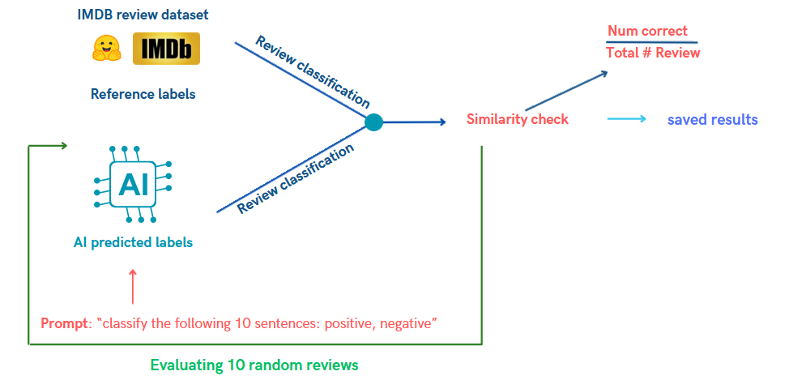
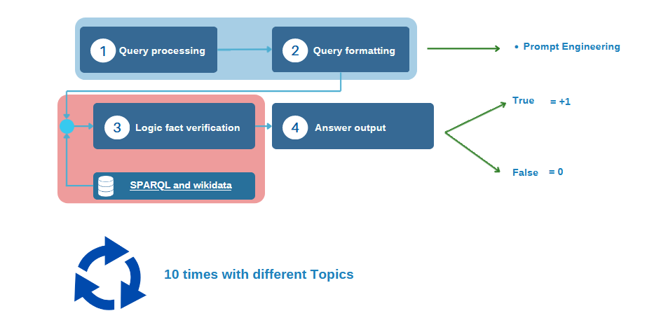

<h1 align="center">
Outils Formels Avancés 2024</h1>

<td> 
</td>
<h2 style="white-space: nowrap">Project: AI Fact Checker</h2></td>

 
 

This repository contains all the informations related to our Fact AI checking project for the course of Outils Formels Avancés 2024 - Master Program at the University of Geneva. 

## Introduction: 

The goal of this project was to create a fact checker to evaluate LLMS, therefore we have created known performance metrics such as rouge metric, sentiment analysis, fact checking... allowing to prompt engineer text generative models to generate well structured answer that we can then check using our metrics.

## Table of contents 

* [1. ROUGE](#1-performance-metric-1-rouge)
* [2. BLEU]()
* [3. Sentiment Analysis](#2-performance-metrix-2-sentiment-analysis)
* [4. Fact Checking](#3-performance-metric-3-fact-checking)
* [5. BERT Score]()
* [6. Natural Language Inference (NLI)]()

### Performance metrics:

**Why?** We want to evaluate text generating LLMs, to do so, we need to define precise performance metrics, below we have defined 6 performance metrics, all of them have corresponding notebooks, in order to use them.

-----------

#### **Guide of use of the performance metrics**

- **1. ROUGE** >Metrics>1_ROUGE.ipynb
- **2. BLUE** >Metrics>2_BLUE.ipynb 
- **3. Fact Checking:** >Notebooks>Metric_3_fact_checking.ipynb 

-------------------------------------------
#### **1: ROUGE** 

Rouge, also called **Recall-Oriented Understudy for Gisting Evaluation** is a metric designed to measure the quality of summaries by comparing them to human reference summaries. ROUGE contains multiple metrics, the one we decided to use is ROUGE-N, which measures the **overlap of N-grams between the LLM-generated summary and the reference summary**.

- **How does it work ?** Compares quality / similarity between reference and generated summary using N-grams. For the reference dataset, we will use the [Xsum](https://paperswithcode.com/dataset/xsum) dataset. This dataset contains 226'771 news articles accompanied with a one-sentence summary. The articles are collected from BBC articles (2010 to 2017) - covering a variety of domains (News, Politics, Sports, Weather, Business, Technology...). Therefore, we decided to select 500 random rows of that dataset, then computed the average number of words in the documents / actual article we want to summarize and the summaries generated by humans. This allowed us to filter out summaries that were too short or too long (that could cause problems when prompt engineering - i.e: text too long and the LLM can't handle too long queries). Therefore, we only keept text between 200 and 500 words and then created a final dataset of 100 articles, containing the summary, the actual article and a unique id. This allowed us to have a csv dataset easy to import for testing the models. 

- 

- **How to use it?**  

**References:**

- [1] Medium article on the [ROUGE metric](https://gandhikunal1021.medium.com/summarization-using-llm-and-measuring-the-performance-with-rouge-part-1-8532ea70c8da)
- [2] [Github Notebook](https://github.com/gk1021/Summarization-LLM) on ROUGE metric
- [3] Medium article on [all metrics](https://medium.com/@bukowski.daniel/a-practical-framework-for-evaluating-text-generation-llms-4016ffa93736)

-------------------------------------------
#### **2: BLEU** 

BLEU, or the Bilingual Evaluation Understudy, is a metric for comparing a candidate translation to one or more reference translations. BLEU evaluates translation quality based on n-gram precision. It calculates the precision of n-grams in the generated translation compared to one or more reference translations. BLEU also incorporates a brevity penalty to discourage overly short translations.

- **How does it work ?**

- 

- **How to use it?**  

**References:**

- [1] Medium article on the [BLEU metric](https://medium.com/@priyankads/evaluation-metrics-in-natural-language-processing-bleu-dc3cfa8faaa5)

-------------------------------------------
#### **3 Sentiment Analysis** 

This metric uses the [IMDB dataset](https://huggingface.co/datasets/imdb) from Huggin Face that has 25,000 highly polar movie reviews for training and provides labels to the corresponding review, either being Positive or Negative. The goal is to query the LLM to ask it if the sentiment is positive and negative. Gathering the data, we then put a score between 0 and 1. 

-------------------------------------------
#### **4 Fact Checking**

This metric uses WikiData and SparQL in order to create queries to specific known facts in Wikipedia. Queries are created to query Wikidata using sparQL and a prompt is asked to the LLM to provide a response to which we have the answer. We repeated this 10 times for different topics and created a score between 0 and 1. For information, link to [wikidata](https://www.wikidata.org/wiki/Wikidata:Main_Page?uselang=fr) or i.e [person](https://www.wikidata.org/wiki/Q215627)

-------------------------------------------
#### **5 BERT score**

-------------------------------------------
#### **6 NLI (Natural Language Inference)**

-------------------------------------------

### **Combining all together: comparing models and results**

In this notebook, we combine all the results to visualize them in a dataframe, to compare the resuts. 