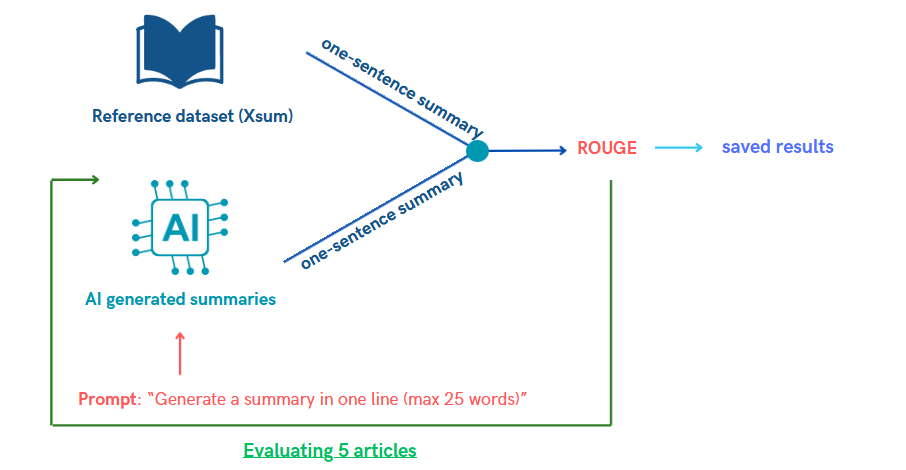

<h1 align="center">
Outils Formels Avancés 2024</h1>

<td> 
</td>
<h2 style="white-space: nowrap">Project: AI Fact Checker</h2></td>

 
 

This repository contains all the informations related to our Fact AI checking project for the course of Outils Formels Avancés 2024 - Master Program at the University of Geneva. 

## Table of contents 
* [...](#)

### Performance metrics:

**Why?** We want to evaluate text generating LLMs, to do so, we need to define precise performance metrics, below we have defined X performance metrics, all of them have corresponding notebooks, in order to use them.

-----------

#### **Guide of use of the performance metrics**

- **1. Performance metric 1: ROUGE** >Notebooks>rouge_metric.ipynb
- 

-------------------------------------------
#### **Performance metric 1: ROUGE:** 

Rouge, also called **Recall-Oriented Understudy for Gisting Evaluation** is a metric designed to measure the quality of summaries by comparing them to human reference summaries. ROUGE contains multiple metrics, the one we decided to use is ROUGE-N, which measures the **overlap of N-grams between the LLM-generated summary and the reference summary**.

- **How does it work ?** Compares quality / similarity between reference and generated summary using N-grams. For the reference dataset, we will use the [Xsum](https://paperswithcode.com/dataset/xsum) dataset. This dataset contains 226'771 news articles accompanied with a one-sentence summary. The articles are collected from BBC articles (2010 to 2017) - covering a variety of domains (News, Politics, Sports, Weather, Business, Technology...). 

-----
**References:**

- [1] Medium article on the [ROUGE metric](https://gandhikunal1021.medium.com/summarization-using-llm-and-measuring-the-performance-with-rouge-part-1-8532ea70c8da)
- [2] [Github Notebook](https://github.com/gk1021/Summarization-LLM) on ROUGE metric

-------------------------------------------
#### **Performance metric 2: BLUE:** 

-------------------------------------------
#### **Performance metric 3: BLUE:** 