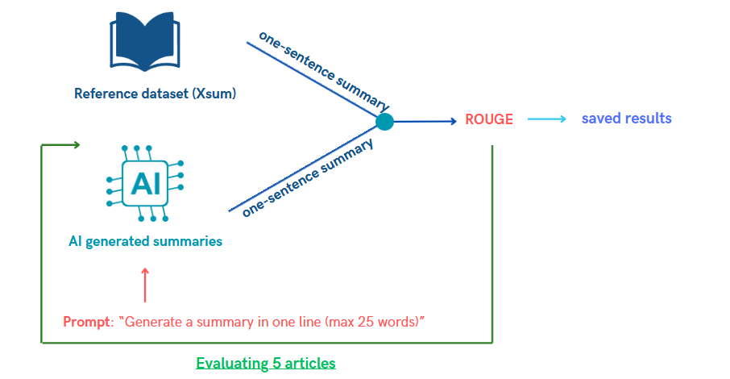

<h1 align="center">
Outils Formels Avancés 2024</h1>

<td> 
</td>
<h2 style="white-space: nowrap">Project: AI Fact Checker</h2></td>

 
 

This repository contains all the informations related to our Fact AI checking project for the course of Outils Formels Avancés 2024 - Master Program at the University of Geneva. 

## Introduction: 

The goal of this project was to create a fact checker to evaluate LLMS, therefore we have created known performance metrics such as rouge metric, sentiment analysis, fact checking... allowing to prompt engineer text generative models to generate well structured answer that we can then check using our metrics.

## Table of contents 

* [1. ROUGE](#1-rouge)
* [2. BLEU](#2-bleu)

-------------------------------------------
#### **1: ROUGE** 

ROUGE, also called **Recall-Oriented Understudy for Gisting Evaluation** is a metric designed to measure the quality of **summaries** by comparing them to **human reference summaries**. ROUGE contains multiple metrics, the one we decided to use is ROUGE-N, which measures the **overlap of N-grams between the LLM-generated summary and the reference summary** - in other words, it looks for the longest common sequence of N-grams between the reference and the summarized text.

- **How does it work ?** Compares quality / similarity between reference and generated summary using N-grams. For the reference dataset, we will use the [Xsum](https://paperswithcode.com/dataset/xsum) dataset. This dataset contains 226'771 news articles accompanied with a one-sentence summary. The articles are collected from BBC articles (2010 to 2017) - covering a variety of domains (News, Politics, Sports, Weather, Business, Technology...). Therefore, we decided to select 500 random rows of that dataset, then computed the average number of words in the documents / actual article we want to summarize and the summaries generated by humans. This allowed us to filter out summaries that were too short or too long (that could cause problems when prompt engineering - i.e: text too long and the LLM can't handle too long queries). Therefore, we only keept text between 200 and 500 words and then created a final dataset of 10 articles, containing the summary, the actual article and a unique id. This allowed us to have a csv dataset easy to import for testing the models. Finally, we studied the number of words in the human generated summary (i.e the average) and established to prompt the LLMs 25 word summaries.  

The image below illustrates the process we have taken for this metric: 
- 1. On one hand we have the reference dataset (containing 10 human made summaries)
- 2. On the other hand we prompt engineer the LLM to provide a 25 word length summary of the article
- 3. Then we combine each of those 10 - reference summary and generated summary and calculate the ROUGE score 

    

- **How to use it?** For more information, you can run the code (locally / Google Colab) - the code can be found [here]()

**References:**
- [1] Medium article on the [ROUGE metric](https://gandhikunal1021.medium.com/summarization-using-llm-and-measuring-the-performance-with-rouge-part-1-8532ea70c8da)
- [2] [Github Notebook](https://github.com/gk1021/Summarization-LLM) on ROUGE metric
- [3] Medium article on [all metrics](https://medium.com/@bukowski.daniel/a-practical-framework-for-evaluating-text-generation-llms-4016ffa93736)

-------------------------------------------
#### **2: BLEU** 

BLEU, or the Bilingual Evaluation Understudy, is a metric for comparing a candidate translation to one or more reference translations. BLEU evaluates translation quality based on n-gram precision. It calculates the precision of n-grams in the generated translation compared to one or more reference translations. BLEU also incorporates a brevity penalty to discourage overly short translations.

- **How does it work ?**

- 

- **How to use it?**  

**References:**

- [1] Medium article on the [BLEU metric](https://medium.com/@priyankads/evaluation-metrics-in-natural-language-processing-bleu-dc3cfa8faaa5)

-------------------------------------------