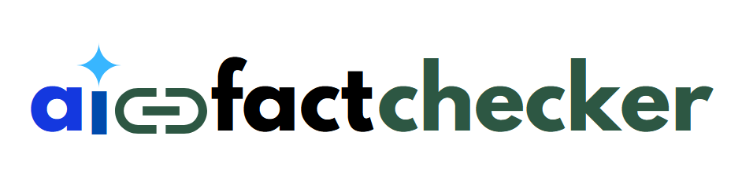

<h1 align="center">
Outils Formels Avancés 2024</h1>
<div>
<td> 
</td>
<h2 style="white-space: nowrap">Project: AI Fact Checker</h2></td>
<hr style="clear:both">
<p style="font-size:0.85em; margin:2px; text-align:justify">
<br>
<br>
</div>

This repository contains all the informations related to our Fact AI checking project for the course of Outils Formels Avancés 2024 - Master Program at the University of Geneva. 

## Table of contents 
* [Recall Project Summary: Oriented AI](#recall-project-summary-oriented-ai)
* [Tentative Planning (feasibility) and General Pipeline](#tentative-planning-feasibility-and-general-pipeline)
* [Step 1 Cleaning the Database and Augmenting](#step-1-cleaning-the-database-and-augmenting)
* [Step 2 SQL as our logic programming checker](#step-2-sql-as-our-logic-programming-checker)
* [Step 3 Creating a query from an answer prompt](#step-3-creating-a-query-from-an-answer-prompt)
* [Step 4 Adding it all together](#step-4-adding-it-all-together)
* [Step 5 Alternatives and more](#step-5-alternatives-and-more)


--------------------------------
### Organizational considerations:
--------------------------------
- Presentation Guidelines & Template can be found [here](https://www.canva.com/design/DAF-DmpNG9c/8ihtV3W0dKmtPwSkx0wwTg/edit?utm_content=DAF-DmpNG9c&utm_campaign=designshare&utm_medium=link2&utm_source=sharebutton)
- All illustrations can be found [here](https://www.canva.com/design/DAF-ic70zwQ/VRxu6NuxIy0cWPR0cb42Sg/edit?utm_content=DAF-ic70zwQ&utm_campaign=designshare&utm_medium=link2&utm_source=sharebutton) (please add date each time)
- All presentations can be found [here](https://www.canva.com/design/DAF-Du2Eg4A/KWLavthYNvOxPrgarOtZJA/edit?utm_content=DAF-Du2Eg4A&utm_campaign=designshare&utm_medium=link2&utm_source=sharebutton)


-----------------------------------
### **Recall Project Summary: Oriented AI**
-----------------------------------

**Warning:** The projects of these category are a lot of personal research and reading. These projects will involve exploration and give you the freedom to set your own goals. You can decide on the final products. Furthermore, you can write a **document to explain your research**, or you can decide to **build something concrete**. However, it is crucial to estimate the feasability of your project ! This is not straightforward and you should be autonomous.

**AI Fact Checker:** The recent hype for ChatGPT also shows many limitations. **This is difficult to check the truth of these answers.** The goal is to use the **programming logic** to verify the truth of the ChatGPT answers. A way to proceed is to analyse its weaknesses, and determine which problems are easily solved by a human and not by the AI. For example, what do we get if we ask for information about a celebrity ? Moreover, what about temporal information that was true one day but was no longer true at a given time? This project can focus on a certain category of information, as well as verifying it.

*Resources:*
- *ChatGPT: ChatGPT*
- *Mistral AI*


--------------------------------
### Tentative Planning (feasibility) and General Pipeline
--------------------------------

---------------


-----------------------------------
### **Step 1 Cleaning the Database and Augmenting**
-----------------------------------
The dataset was taken from a Github repository that can be found [here](https://github.com/awhstin/Dataset-List/blob/master/presidents.csv). This dataset seems to have taken public data provided from the Guardian, which can be found [here](https://www.theguardian.com/news/datablog/2012/oct/15/us-presidents-listed).

The dataset includes information on all U.S. presidents, featuring details such as the president's name, party affiliation, term duration, and a numerical identifier representing their order in the sequence of U.S. presidents.

The structure of the dataset is the following: 
- It contains 4 rows:
    - **President Name:**  The name of the individual who served as the president.
    - **Years in Office:** The duration (years) during which the president held office.
    - **Number:** The president number, based on all US presidents
    - **Party:** The political party affiliation of the president during their term(s) in office.

**However**, we need to simplify the structure of the dataset to provide a more comprehensive way to query the information of this dataset. In addition, we would like to augment the response (Fact-checked or not) with actual reliable sources (which lacks in ChatGPT's current version). To do so, we are going to go through the two following steps:

Both steps can be found on the [Notebook](/Notebooks/Step_1_cleaning_augmenting_dataset.ipynb)
- **Step 1: Simplifying / Renaming the dataset:** In this step, we are going to rename columns and reorganize the database
- **Step 2: Augmenting the database:** In this step, we are going to add another column with actual links related to the presidents, in order to provide an advanced search to the user once the statement or fact is checked ! 
- **Step 3: Saving the final database for later use**


-----------------------------------
### **Step 2 SQL as our logic programming checker**
-----------------------------------

In this section, we are going to use SQL to query the answer sent from chatGPT to see if the answer to that query is actually in our database. A visual illustration of that process can be found below:


To do so and have a quick deployable solution, we are going to use Google Big Query. To do so, we generated the given keys and completed the following [Notebook](/Notebooks/Step_2_big_query.ipynb) **NOTE** To make it easier, it is better to run the code directly on Google Colab. The main steps are described below:
- **Step 1: Connect to the Big Query - Google Cloud Platform** In this step, we imported our dataset on Big Query and generated the keys to have access to the database from our notebook **NOTE** Big query is not free for too many queries, so please beware of not sending to many queries at the time
- **Step 2: Test the database and simple queries** In this step, we created simple SQL queries to test the connection
- **Step 3: Sample query from chatGPT and fact check!** In this step, we created sample queries and looked at the results given by our database, more on the notebook.


-----------------------------------
### **Step 3 Creating a query from an answer prompt**
-----------------------------------
The important question is to see how we can truly get the SQL query in the correct format in order to compare it to our database. To answer this question, we will test two theories and find the best one. For both, we will use 10 queries and see which method is the best. 
- **Method 1: prompt engineering** This is the more simple method, where we explicitely ask to chatGPT the formatted query
- **Method 2: Name Entity Resolution** We will use NER from spacy to try to create the formatted query. 


-----------------------------------
### **Step 4 Adding it all together**
-----------------------------------

**To run the front-end**
- cd .\frontend_and_backend\fact-checker-app\
- npm start (to launch the app on local host)

**To run the python server**
-  cd .\frontend_and_backend\backend\
-  python server.py

**Good practice to see if everything works correctly**
- Run the get request on POSTMAN: http://localhost:5000/presidents

- Run with docker - easier -> **2 Possibilities:**
    - **Option 1:** Run both front-end and back-end in two dockers
        - Go to the frontend folder
        - ```bash
          docker build -t frontend-ai-checker-v1 .
          docker run -p 80:80 frontend-ai-checker-v1
        - Go to the backend folder
        - ```bash
          docker build -t backend-ai-checker-v2 .
          docker run -p 5000:5000 backend-ai-checker-v2
    - **Option 2:** Run both dockerfiles at the same time, go to the folder frontend-and-backend and run:
        - ```bash
          docker-compose up


### **Step 5 Alternatives and more**

- **More: Augmented Answers:**
    - One idea would be to create a LMM (question answering with BERT) for specific questions. I.e: if we want to check the answer of ChatGPT of the presidence of Barack Obama, if the answer is valid, we could provide an **augmented answer**, I.e:
        - With more precise links to the actual ressouces 
        - Create a question - answer LLM trained on those sources:  Reference to Github (works, to execute on Google Colab GPU): https://github.com/the-ogre/LLM-FinetuningBERTforQuestionAnswering/blob/main/bert-fine-tuning-for-qa.ipynb
- **Alternatives:** Another way to check the validity of the answers is to directly query the Google API and check the cosine similarity between the answer given by chatGPT and the answer of the first search provided by Google. The pipeline could look like this:

Please refer to [this]() notebook for more information.
