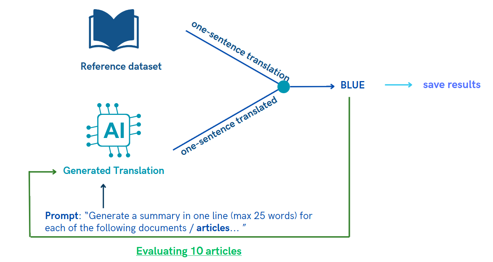

<h1 align="center">
Outils Formels Avancés 2024</h1>

<td> 
</td>
<h2 style="white-space: nowrap">Project: AI Fact Checker</h2></td>

 
 

This repository contains all the informations related to our Fact AI checking project for the course of Outils Formels Avancés 2024 - Master Program at the University of Geneva. 

## Introduction: 

The goal of this project was to create a fact checker to evaluate LLMS, therefore we have created known performance metrics such as rouge metric, sentiment analysis, fact checking... allowing to prompt engineer text generative models to generate well structured answer that we can then check using our metrics. We have decided to organize the metrics in the following ways:

    

## Table of contents 

* [1. ROUGE](#1-rouge)
* [2. BLEU](#2-bleu)
* [3. Sentiment Analysis](#3-sentiment-analysis)
* [4. Fact Checking](#4-fact-checking)
* [5. BERT](#5-bert)
* [6. Roberta](#6-Roberta)
* [7. Combining the results](#7-combining-the-results)
-------------------------------------------

### 1: ROUGE 

ROUGE, also called **Recall-Oriented Understudy for Gisting Evaluation** is a metric designed to measure the quality of **summaries** by comparing them to **human reference summaries**. ROUGE contains multiple metrics, the one we decided to use is ROUGE-N, which measures the **overlap of N-grams between the LLM-generated summary and the reference summary** - in other words, it looks for the longest common sequence of N-grams between the reference and the summarized text.

- **How does it work ?** Compares quality / similarity between reference and generated summary using N-grams. For the reference dataset, we will use the [Xsum](https://paperswithcode.com/dataset/xsum) dataset. This dataset contains 226'771 news articles accompanied with a one-sentence summary. The articles are collected from BBC articles (2010 to 2017) - covering a variety of domains (News, Politics, Sports, Weather, Business, Technology...). Therefore, we decided to select 500 random rows of that dataset, then computed the average number of words in the documents / actual article we want to summarize and the summaries generated by humans. This allowed us to filter out summaries that were too short or too long (that could cause problems when prompt engineering - i.e: text too long and the LLM can't handle too long queries). Therefore, we only keept text between 200 and 500 words and then created a final dataset of 10 articles, containing the summary, the actual article and a unique id. This allowed us to have a csv dataset easy to import for testing the models. Finally, we studied the number of words in the human generated summary (i.e the average) and established to prompt the LLMs 25 word summaries.  

The image below illustrates the process we have taken for this metric: 
- 1. On one hand we have the reference dataset (containing 10 human made summaries)
- 2. On the other hand we prompt engineer the LLM to provide a 25 word length summary of the article
- 3. Then we combine each of those 10 - reference summary and generated summary and calculate the ROUGE score 

    

- **How to use it?** For more information, you can run the code (locally / Google Colab) - the code can be found [here](./Notebooks/1_ROUGE.ipynb)

- **What output results?** ROUGE-1 is often preferred as the primary evaluation metric due to its simplicity, robustness, and ability to capture the essence of summary quality based on unigram overlap.

**References:**
- [1] Medium article on the [ROUGE metric](https://gandhikunal1021.medium.com/summarization-using-llm-and-measuring-the-performance-with-rouge-part-1-8532ea70c8da)
- [2] [Github Notebook](https://github.com/gk1021/Summarization-LLM) on ROUGE metric
- [3] Medium article on [all metrics](https://medium.com/@bukowski.daniel/a-practical-framework-for-evaluating-text-generation-llms-4016ffa93736)

-------------------------------------------
### 2: BLEU 

BLEU, or the Bilingual Evaluation Understudy, is a metric for comparing a candidate translation to one or more reference translations. BLEU evaluates translation quality based on n-gram precision. It calculates the precision of n-grams in the generated translation compared to one or more reference translations. BLEU also incorporates a brevity penalty to discourage overly short translations.

- **How does it work ?**
    - BLEU breaks down both the reference and generated text into smaller units called n-grams (sequences of n words). It then counts how many of these n-grams in the generated text also appear in the reference text.
    - BLEU calculates a precision score for each n-gram size (usually up to 4-grams). Precision measures how many of the n-grams in the generated text match with the n-grams in the reference text.
    - Finally, BLEU combines all these factors into a single score between 0 and 1. A higher BLEU score indicates a better match between the generated text and the reference text.

    

- **How to use it?**  For more information, you can run the code (locally / Google Colab) - the code can be found [here](./Notebooks/2_BLEU.ipynb)

**References:**
- [1] Medium article on the [BLEU metric](https://medium.com/@priyankads/evaluation-metrics-in-natural-language-processing-bleu-dc3cfa8faaa5)

#### BLEU and ROUGE:
- **BLEU** focuses on precision by counting matching n-grams between the generated and reference text.
- **ROUGE** focuses on recall by measuring overlapping units like words, n-grams, and sequences between the generated and reference text.
-------------------------------------------
### 3: Sentiment Analysis 

Sentiment analysis adds depth to language understanding by enabling machines to discern emotional tones within text, enhancing natural language processing capabilities. This capability is particularly valuable for sentiment-aware applications like customer feedback analysis, brand monitoring, and social media sentiment tracking, facilitating informed decision-making and enhancing user experiences.

- **How does it work ?**
This metric uses the [IMDB dataset](https://huggingface.co/datasets/imdb) from Huggin Face that has 25,000 highly polar movie reviews for training and provides labels to the corresponding review, either being Positive or Negative. The goal is to query the LLM to ask it if the sentiment is positive and negative. Gathering the data, we then put a score between 0 and 1. 

    

- **How to use it?**  For more information, you can run the code (locally / Google Colab) - the code can be found [here](./Notebooks/3_Sentiment_Analysis.ipynb)

**References:**
- [1] Medium article on [evaluating LLMs](https://medium.com/data-science-at-microsoft/evaluating-llm-systems-metrics-challenges-and-best-practices-664ac25be7e5) 
-------------------------------------------
### 4: Fact Checking 

Fact-checking with language models involves verifying the accuracy of statements by comparing them against reliable sources like Wikidata or Wikipedia. This process enhances the credibility and reliability of information disseminated by language models, fostering trust in AI-generated content and promoting informed decision-making in various domains, including journalism, research, and public discourse.

- **How does it work ?**
This metric uses WikiData and SparQL in order to create queries to specific known facts in Wikipedia. Queries are created to query Wikidata using sparQL and a prompt is asked to the LLM to provide a response to which we have the answer. We repeated this 10 times for different topics and created a score between 0 and 1. For information, link to [wikidata](https://www.wikidata.org/wiki/Wikidata:Main_Page?uselang=fr) or i.e [person](https://www.wikidata.org/wiki/Q215627)

    

- **How to use it?**  For more information, you can run the code (locally / Google Colab) - the code can be found [here](./Notebooks/4_Fact_checking.ipynb)

**References:**
- [1] [SparQL](https://docs.data.world/tutorials/sparql/)
-------------------------------------------
### 5: BERT

BERTScore is a metric used to evaluate the quality of generated text by comparing it to a reference text. It assesses how similar the generated text (candidate) is to the reference text (precision, recall and F1 score).
In simple terms, BERTScore gives us a way to quantitatively measure how well a generated piece of text matches a reference text. Higher BERTScores indicate better quality generated text. It's useful for evaluating the performance of language models and text generation systems.
- **How does it work ?**
Using BERT score to compare generated summaries from language models (LLMs) with human-generated summaries offers a quantitative assessment of their quality based on semantic similarity. BERT score leverages pre-trained contextualized word embeddings to capture nuanced semantic information, providing a more nuanced evaluation than traditional metrics like BLEU. This approach enables finer-grained analysis of LLM outputs, helping researchers and developers identify areas for improvement and fine-tune model performance to better match human-written summaries, ultimately enhancing the overall quality and usability of LLMs.

    

- **How to use it?**  For more information, you can run the code (locally / Google Colab) - the code can be found [here](./Notebooks/5_BERT_Score.ipynb)

**References:**
- [1] [BERT Score](https://huggingface.co/spaces/evaluate-metric/bertscore)

-------------------------------------------
### 6: Roberta

ROBERTa, or Robustly Optimized BERT Approach, is a type of language model, which is a computer program that understands and generates human-like text. It's based on BERT, another popular language model, but ROBERTa is even better at understanding the context and meaning of words in a piece of text. It's like having a super-smart assistant that can read and write text in a way that's very similar to how humans do, making it incredibly useful for tasks like summarizing articles, answering questions, or even generating creative stories.
- **How does it work ?**
Utilizing ROBERTa score to evaluate generated summaries from language models against human-generated counterparts offers a robust metric for assessing semantic similarity. ROBERTa, a variant of BERT, employs large-scale pre-training and fine-tuning on diverse datasets, capturing intricate semantic nuances effectively. This comprehensive understanding enables precise evaluation, aiding developers and researchers in refining language model outputs to closely match human-written summaries. Consequently, leveraging ROBERTa score enhances the accuracy and utility of language models across various applications.

    

- **How to use it?**  For more information, you can run the code (locally / Google Colab) - the code can be found [here](./Notebooks/6_RobBERT.ipynb)

**References:**
- [1] [ROBERTA](https://huggingface.co/docs/transformers/model_doc/roberta)

-------------------------------------------
### 7. Combining the results

To take advantage of the notebooks we have created and to test the models with the metrics, we have decided to create two notebooks:

    - 1. The first one allows to execute all the metrics for a particular LLM
    - 2. The second one allows to combine all the results and to plot them

- These are the results of our findings:
--> Present RESULTS
--> recompute heat map
--> plot also more specific results, i.e just comparing rouge across models... 

    

