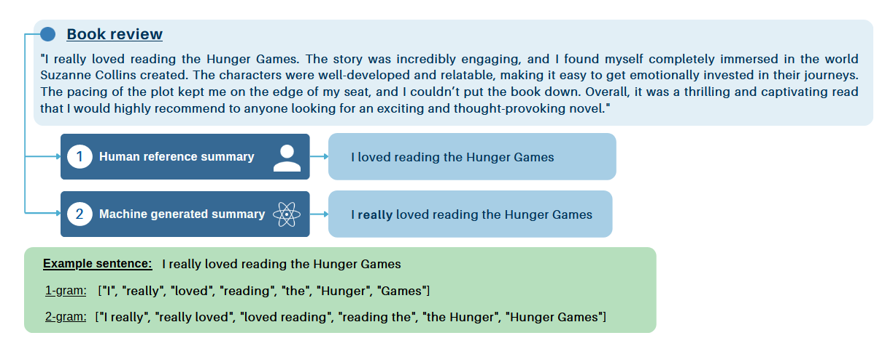

## Table of Contents

### ROUGE
1. [What it is - Common Use Cases](#what-it-is---common-use-cases)
2. [Different Ways to Evaluate It](#different-ways-to-evaluate-it)
3. [Different Ways of Computing It](#different-ways-of-computing-it)
4. [Advantages and Disadvantages](#advantages-and-disadvantages)

### BLEU
1. [What it is - Common Use Cases](#what-it-is---common-use-cases-1)
2. [Different Ways to Evaluate It](#different-ways-to-evaluate-it-1)
3. [Different Ways of Computing It](#different-ways-of-computing-it-1)
4. [Advantages and Disadvantages](#advantages-and-disadvantages-1)

### BERTScore
1. [What it is - Common Use Cases](#what-it-is---common-use-cases-2)
2. [Different Ways to Evaluate It](#different-ways-to-evaluate-it-2)
3. [Different Ways of Computing It](#different-ways-of-computing-it-2)
4. [Advantages and Disadvantages](#advantages-and-disadvantages-2)

--------------------------------------------

## ROUGE: 

### 1. What it is - Common Use Cases

**ROUGE** (Recall-Oriented Understudy for Gisting Evaluation) is a set of metrics used to evaluate the **quality of summaries and machine-generated texts** by **comparing them to one or more reference texts** (usually human-generated). It **measures how well the machine-generated text** captures the **important content** of the **reference text**. So in simpler words, it assigns a single numerical score to a generated summary, telling us how good it is compared to a reference summary. It is done by comparing the N-grams (word sequence or word pairs) of the generated summary to the N-grams of the reference summary (An N-gram is just a chunk of n words). The image below illustrates the metric:

**Common Use Cases:**
- Evaluating the performance of automatic summarization systems.
- Comparing different versions of machine-generated texts to reference summaries.
- Assessing the quality of machine translation outputs.

### 2. Different Ways to Evaluate It
**ROUGE** can be evaluated using recall, precision, and F1 score:

- **Precision:** Measures how much of the generated text matches the reference text (or proportion of n-grams in the generated summary which is also in the reference summary)
- **Recall:** Measures how much of the reference text is captured by the generated text (or proportion of n-grams in reference summary which is also in the generated summary)
- **F1 Score:** The harmonic mean of precision and recall, providing a balanced measure.

**Most Used Metric:**
- **ROUGE Recall** is often the most emphasized because it **measures the completeness of the generated text in capturing the reference content**

The figure below illustrates the scores and how they are computed:

### 3. Different Ways of Computing It
**ROUGE** has several variants based on different n-grams and methods:

- **ROUGE-N (N-gram overlap):**
  - **ROUGE-1:** Measures overlap of unigrams (single words).
  - **ROUGE-2:** Measures overlap of bigrams (two-word sequences).
  - **ROUGE-L (Longest Common Subsequence):** Measures the longest sequence of words that appear in both the reference and generated text in the same order.

### 4. Advantages and Disadvantages

**Advantages:**
- **Easy to Compute:** ROUGE metrics are straightforward to calculate.
- **Widely Accepted:** Commonly used in the research community, making results comparable across studies.
- **Flexible:** Can be adapted to different types of text comparisons (unigrams, bigrams, LCS).

**Disadvantages:**
- **Focus on Overlap:** May favor longer texts that include more of the reference text, potentially leading to verbosity.
- **Ignores Meaning:** Does not account for the semantic meaning of the words, focusing only on exact matches.
- **Sensitivity to Synonyms and Paraphrasing:** May penalize texts that convey the same meaning using different words.

**References for Rouge:**
- HuggingFace youtube [video](https://www.youtube.com/watch?v=TMshhnrEXlg)
- Medium [article](https://medium.com/@kbdhunga/nlp-model-evaluation-understanding-bleu-rouge-meteor-and-bertscore-9bad7db71170) 

----------------

## BLEU: 

### 1. What It Is - Common Use Cases
**BLEU** (Bilingual Evaluation Understudy) is a metric used to evaluate the quality of text generated by machine translation systems by **comparing it to one or more reference translations**. It **measures how well the generated text matches the reference text(s) based on the precision of n-grams**. In other words, it assigns a single numerical score to a translation that indicates if it is good compared to reference translations. It primarly focuses on precision. 

**Common Use Cases:**
- Evaluating the performance of **machine translation systems**.
- Comparing different versions of **machine-generated texts to reference translations**.
- **Assessing the quality of text summarization**

### 2. Different Ways to Evaluate It
**BLEU** primarily focuses on precision, but it also incorporates a brevity penalty to discourage overly short translations.

- **Precision:** Measures the proportion of n-grams in the generated text that match the n-grams in the reference text.
- **Brevity Penalty (BP):** Applied to penalize short translations that might have high precision but are incomplete. **Example:** If the **generated text is shorter than the reference text**, the BP reduces the final BLEU score.

**Most Used Metric:**
- **BLEU Score:** Combines precision and the brevity penalty to give an overall score.
  - **Formula:** BLEU = BP * exp(Σ log precision_n / N), where N is the highest order of n-gram considered.

### 4. Advantages and Disadvantages
**Advantages:**
- **Quantitative Measure:** Provides a numerical score to easily compare different models.
- **Widely Used:** Accepted and commonly used in the research community, facilitating comparisons across studies.
- **Simple to Compute:** Easy to implement and calculate.

**Disadvantages:**
- **Ignores Meaning:** Focuses on exact n-gram matches, not the semantic meaning of the text. In fact, only evaluates surface-level lexical similarities, overlooking deeper semantic and contextual nuances of language. 
- **Penalizes Synonyms:** Does not account for synonyms or paraphrasing, which can result in lower scores for valid translations.
- **Length Bias:** The brevity penalty can sometimes overly penalize shorter translations even if they are correct.

**References for Bleu:**
- HuggingFace youtube [video](https://www.youtube.com/watch?v=M05L1DhFqcw)
- Medium [article](https://medium.com/@kbdhunga/nlp-model-evaluation-understanding-bleu-rouge-meteor-and-bertscore-9bad7db71170) 

-------------------------------------

## BERT: 

### 1. What It Is - Common Use Cases

**BERTScore** is a metric for evaluating the quality of text generation, such as **machine translation, summarization, and other natural language processing (NLP) tasks.** It leverages contextual embeddings from BERT (Bidirectional Encoder Representations from Transformers) to measure the similarity (cosine similarity) between generated and reference texts at the word level, taking into account context and meaning.  

**Common Use Cases:**
- Evaluating machine translation outputs.
- Assessing the quality of **text summarization.**
- Comparing **outputs from various NLP models** to reference texts.

### 2. Different Ways to Evaluate It

**BERTScore** evaluates text using precision, recall, and F1 score based on contextual embeddings rather than exact n-gram matches.

- **Precision:** For each token in the generated text, it selects the maximum similarity score with tokens in the reference text and averages these scores.
- **Recall:** For each token in the reference text, it selects the maximum similarity score with tokens in the generated text and averages these scores.
- **F1 Score:** The harmonic mean of precision and recall, providing a balanced measure.

For each token in the candidate text, BERTScore selects the maximum similarity score with tokens in the reference text. It then averages these scores to compute the final precision score. A similar process is applied for recall (considering each token in the reference text), and an F1 score is calculated from the precision and recall.

### 4. Advantages and Disadvantages

**Advantages:**
- **Contextual Understanding:** Uses contextual embeddings to capture semantic meaning, making it more robust to synonyms and paraphrasing.
- **Less Sensitivity to Exact Matches:** Unlike n-gram-based metrics, BERTScore can identify similarity in meaning even if the exact words differ.
- **Better for Longer Texts:** Handles longer texts and sentences more effectively by considering context.

**Disadvantages:**
- **Computationally Intensive:** Requires significant computational resources to generate embeddings and compute similarity scores.
- **Dependency on Pretrained Models:** Relies on the quality of the pretrained BERT model and may not perform well if the model is not well-suited to the specific language or domain.
- **Interpretability:** The scores are based on high-dimensional embeddings, which can be less interpretable compared to simple n-gram overlaps.

